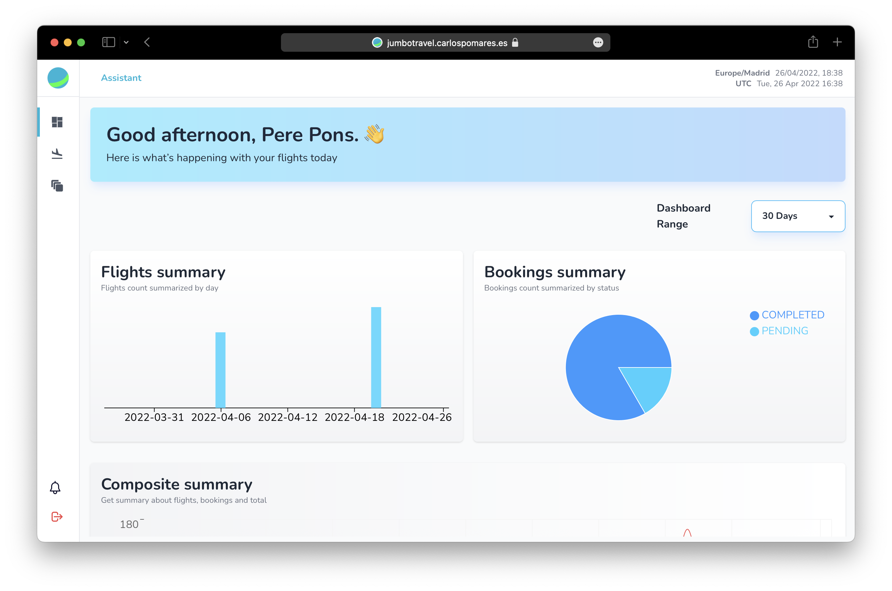
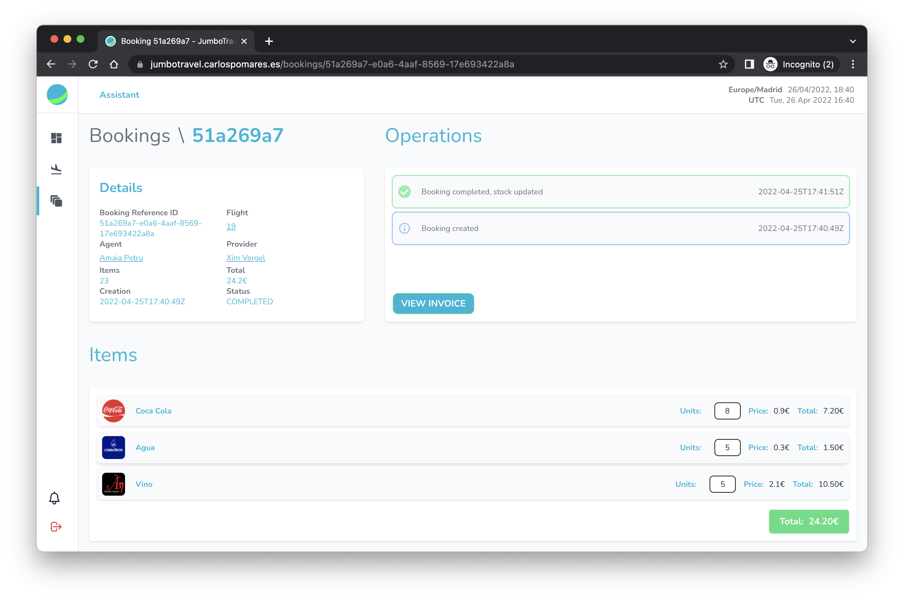

<!-- PROJECT LOGO -->
<br />
<p align="center">
  <a href="https://github.com/pomaretta/jumbotravel">
    
  </a> 
  <p align="center">
  </p>
    <hr />
</p>

This is the final project for the subjet **UI Development** of [CIDE College](https://cide.es).





## **Description**

JumboTravel is the supplier for the snack and drinks of the **SpainAIR** Flights. This project aims to provide a platform for the Flights to order their snacks and drinks, in contact with the provider.

There's a demo version of the project [here](https://jumbotravel.carlospomares.es).

```bash
# Assistant Credentials: 
echo "identifier: 999999999"
echo "password: IL4veJumb0"
```

```bash
# Provider Credentials: 
echo "identifier: 171717171"
echo "password: IL4veJumb0"
```

## **JumboTravel Portal**

The portal brings to the user the possibility to order their snacks and drinks, also the portal has the possibility to see the status of the order and validate it, through the Provider Module.

[See more!](https://github.com/pomaretta/jumbotravel/tree/main/jumbotravel-portal)

## **JumboTravel API**

The API provides an interface to the Web Portal and more tools, allowing access to the JumboTravel data.

[See more!](https://github.com/pomaretta/jumbotravel/tree/main/jumbotravel-api)
